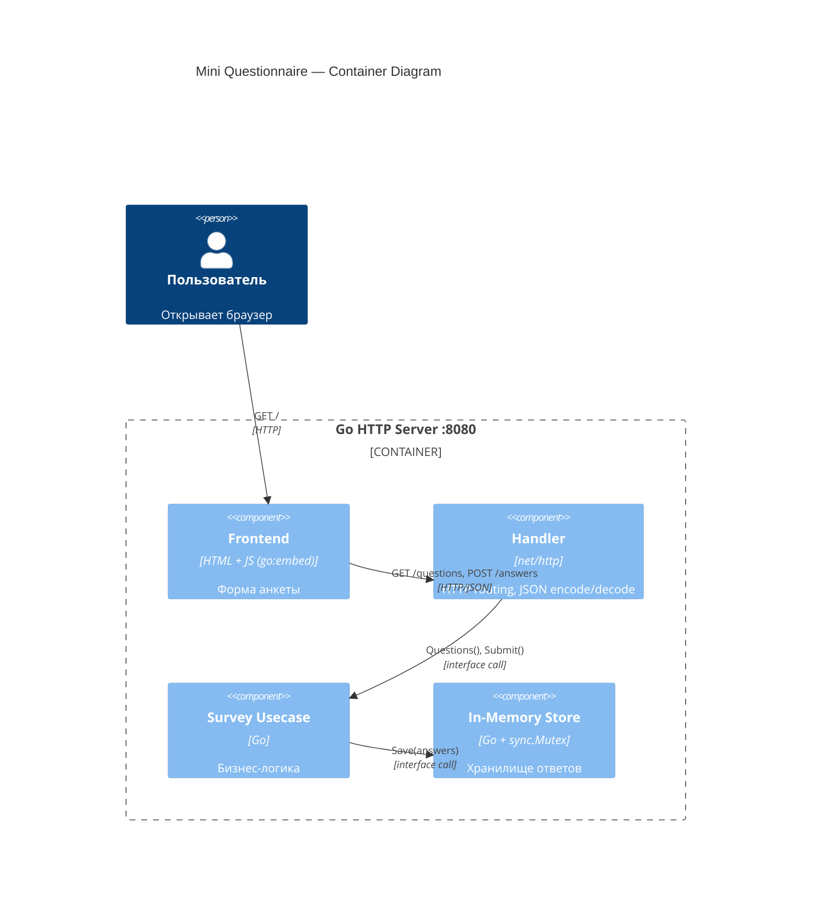
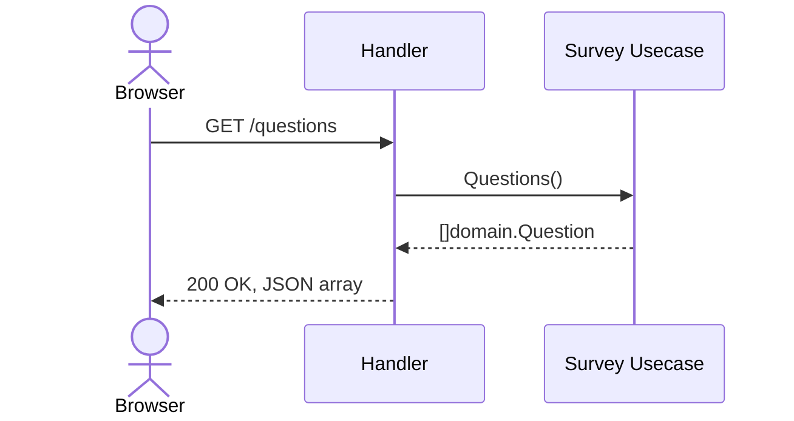
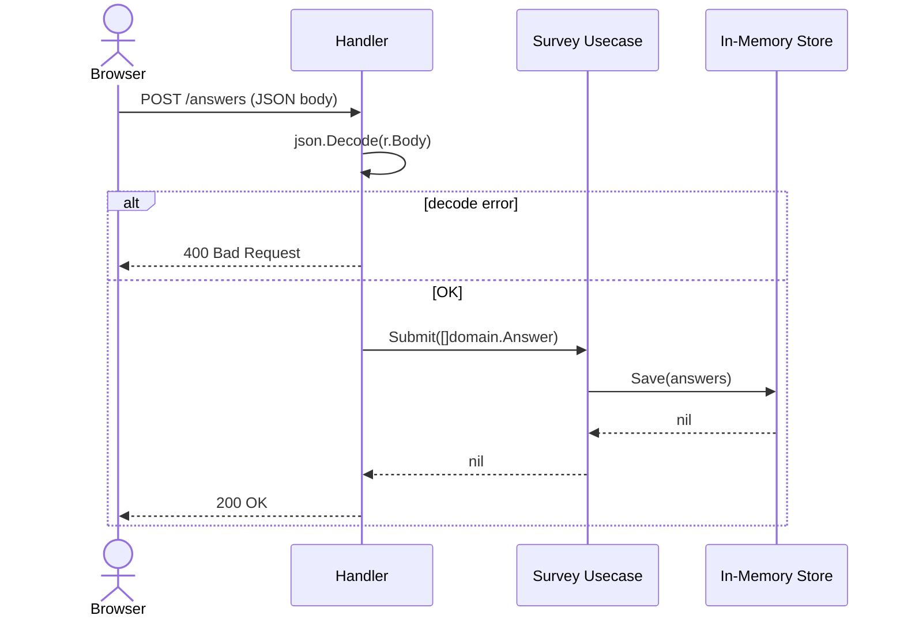

# Design: Мини-анкета (Mini Questionnaire)

## Цель и контекст

Простое full-stack приложение: Go HTTP-сервис раздаёт вопросы и хранит ответы в памяти.
Frontend встроен в бинарник через `go:embed` — один процесс, нет CORS, нет зависимостей от внешних файлов.
Архитектура: Clean Architecture с ручным DI в `main.go` (< 5 сервисов — библиотека не нужна).

---

## Архитектура

### Слои clean architecture

```
cmd/server/main.go                ← точка входа, wiring (DI root)
├── internal/domain/survey.go     ← Entity: чистые типы, нет зависимостей
├── internal/usecase/survey.go    ← Usecase: бизнес-логика + Store interface
├── internal/repository/store.go  ← Repository: in-memory реализация Store
├── internal/handler/survey.go    ← Handler: HTTP + Usecase interface
└── web/
    ├── index.html                ← Frontend
    └── embed.go                  ← go:embed FS
```

**Направление зависимостей** (Dependency Rule):
```
handler → usecase → repository
   ↓           ↓          ↓
 domain      domain     domain
```

Каждый слой зависит только от интерфейсов нижележащего, не от конкретных типов.

### Слои подробно

- **Entity** (`internal/domain/`): `Question`, `Answer` — чистые Go-структуры, нет импортов кроме стандартной библиотеки
- **Usecase** (`internal/usecase/`): `Survey` struct + `Store` interface (определён здесь — где потребляется). Содержит хардкоженный список вопросов.
- **Repository** (`internal/repository/`): `store` struct реализует `usecase.Store`. `sync.Mutex` + `[][]domain.Answer`.
- **Handler** (`internal/handler/`): `Handler` struct + `Usecase` interface (определён здесь). HTTP encode/decode, 405/400/500 ответы.

### Маршруты ServeMux (Go 1.22+ method syntax)

| Метод | Путь | Handler method | Usecase method |
|-------|------|----------------|----------------|
| GET | /questions | `Handler.Questions` | `Survey.Questions()` |
| POST | /answers | `Handler.Submit` | `Survey.Submit()` |
| GET | / | `http.FileServerFS(web.FS)` | — |

---

## Диаграммы

### C4 — уровень контейнеров



### Sequence — GET /questions



### Sequence — POST /answers



---

## Go-интерфейсы по слоям

### Usecase-интерфейс (handler → usecase)

Определяется в `internal/handler/survey.go` (где потребляется):

```go
// internal/handler/survey.go
type Usecase interface {
    Questions() []domain.Question
    Submit(answers []domain.Answer) error
}
```

### Repository-интерфейс (usecase → repository)

Определяется в `internal/usecase/survey.go` (где потребляется):

```go
// internal/usecase/survey.go
type Store interface {
    Save(answers []domain.Answer) error
}
```

### Compile-time interface check

```go
// internal/repository/store.go
var _ usecase.Store = (*store)(nil)
```

---

## Entity-типы (`internal/domain/survey.go`)

```go
type Question struct {
    ID   int    `json:"id"`
    Text string `json:"text"`
}

type Answer struct {
    QuestionID int    `json:"question_id"`
    Text       string `json:"text"`
}
```

---

## Конструкторы и ручной DI (`cmd/server/main.go`)

```go
store   := repository.New()   // *repository.store
survey  := usecase.New(store) // *usecase.Survey
handler := handler.New(survey) // *handler.Handler

mux := http.NewServeMux()
mux.HandleFunc("GET /questions", handler.Questions)
mux.HandleFunc("POST /answers",  handler.Submit)
mux.Handle("/", http.FileServerFS(web.FS))

log.Fatal(http.ListenAndServe(":8080", mux))
```

---

## go:embed (`web/embed.go`)

```go
package web

import "embed"

//go:embed index.html
var FS embed.FS
```

---

## Middleware и сквозные concerns

| Concern | Решение |
|---------|---------|
| CORS | Не нужен — фронтенд раздаётся с того же origin |
| Логирование | Нет (не требуется) |
| Recovery (panic) | Нет (нет паник в lib-коде) |
| Таймауты | Нет (нет внешних вызовов) |
| Method check | Встроен в Go 1.22+ ServeMux (`"GET /path"`) |
| Content-Type | `application/json` выставляется в handler вручную |

---

## Структура файлов

```
hw1/
├── cmd/server/
│   └── main.go
├── internal/
│   ├── domain/
│   │   └── survey.go
│   ├── usecase/
│   │   ├── survey.go
│   │   └── survey_test.go
│   ├── repository/
│   │   ├── store.go
│   │   └── store_test.go
│   └── handler/
│       ├── survey.go
│       └── survey_test.go
├── web/
│   ├── index.html
│   └── embed.go
├── go.mod
├── Makefile
└── docs/
    ├── research.md
    └── design.md
```

---

## Открытые вопросы

Нет — все решения приняты на этапе research.
